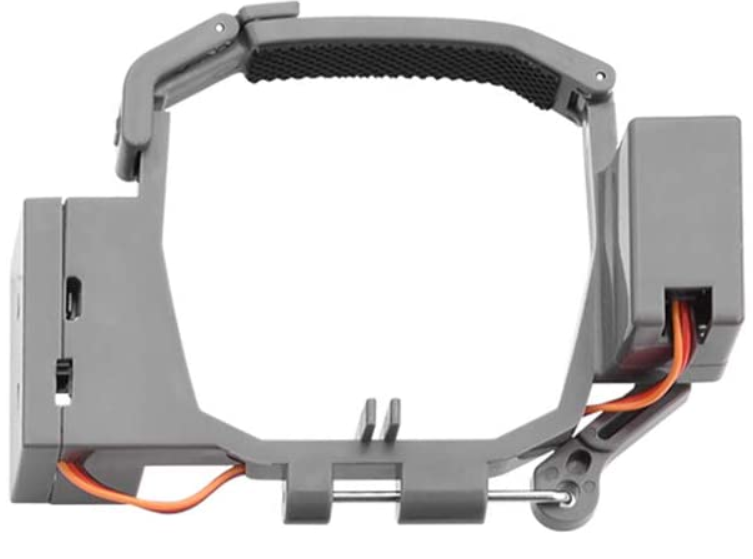

Team Lead: Joseph Stevens - joseph.stevens1@louisiana.edu

Members:
* Nathan Madsen   - nathan.madsen1@louisiana.edu
* Brennan Moeller - Brennan.moeller1@louisiana.edu
* Benjamin Willis - benjamin.willis1@louisiana.edu

# Integration of a UAV to the RoboBoat to aid in task completion and navigation

## Long-term Project Goal
Integrate a drone to the RoboBoat to increase the points gained while completing certain tasks and aid in navigating the courses more efficiently.

## Short-term Goal
To define specific metrics for success.

## Recent Results Overview

1. Overall Point Goal Success: One of our metrics for success was to define in point goals what it looked like for us to win the competition with the integration of the drone. We looked at what tasks remained the same from 2017-2020 and evaluated end result score sheets for the competing teams. We took averages of points from the first place winner per each task over 2/3/and 4 competitions where information was available. For the points that stayed the same, we recorded those.

    a) WEIGHT/THRUST - approximate increase of 11 lbs from enclosure and 4 lbs from the drone
        - 74 points from weight
        - 14 points from thrust
        - 88 total points

    b) MANDATORY/AUTONOMOUS NAVIGATION CHANEL
        - 100 points

    c) SPEED CHALLENGE
        - 210 < points < 227 for fastest time
            -- the fastest time average was 31 seconds with a min = 23 and max = 40.
        - 250 additional points for fastest time
        - 50  points for entering through the gates
        - 100 points for circle the blue buoy
        - 100 points for exited through the gates

    d) UAV/ASV COLLABORATION OPERATIONS
        - 225 points to launch
        - 250 points to land
        - 750 perfect operation (I.E: raise the flag/docking)

    e) OBSTACLE FIELD/FIND THE PATH
        - 100 Enter obstacle field
        - 200 Circle can buoy
        - 200 Exit obstacle field
        - 200 no buoys hit
        - 400 Perfect

    f) DELIVERABLES
        - 86% of total available points for the technical design report (average of first place percentages over 3 years)
        - 82% of total available points for Website (average of first place over 3 years)
        - 10 points for team uniform (average of first place over 3 years)
        - 67.5% of the total available points for craftsmanship (average of first place over 3 years)
        - 94% of the total available points for Video Presentation (average of first place over 3 years)

2. Drone Operation Success:

    a) Have a successful launch and landing
        - Take off from helipad on the boat autonomously without tipping or falling into the water
        - Maintain stable flight while launching
        - Maintain stable flight while landing and land back on the pre-determined location.

    b) Capture stable/clear Picture of the course
        - Pixel count - Minimum of 8 Mega Pixels

    c) Map course
        - Within 1 meter of accuracy at worst
        -- With this we believe that if we get the mapping within 1 meter of accuracy, the camera vision and LiDAR on the boat can will provide the system with more precision while navigating around objects. The goal for the map is to have something useful and accurate enough so that the boat can get to from task to task while navigating the entire course.
        - The drone needs to be a high enough above the water to produce an image of a 250x400 ft area
        - Interpret the image produced by the drone through a python and ROS compatible library. This will most likely be OpenCV.

    d) Drone has to be able to maintain flight path within a pre-defined geo-fence.
        - Left, Right, Up, Down in a pre-defined area
        - Meet all competition specs (geo-fence, kill switch, predefined "home")

    e) Battery
        - Average of 30 minutes of flight time at max power consumption

    f) The drone should have enough static stability to stay on the helipad while the boat is moving through the water until the drone is deployed.
        - something should be on the top of the helipad to increase friction between the feet of the drone and the helipad. This could be done with sandpaper, rubber, or velcro.

    g) What is an acceptable payload baseline?
        - 2:1 TWR would be fine for this application unless rules specify the need for a heavy payload.

    h) Have the ability to pick up and drop off objects
        - Depending on the rules this could be anything from a hook to a servo with a pin/channel mechanism as shown in Figure 1.

     
    <strong>Figure 1: Example of a Pick Up/Drop Off Mechanism</strong>

3. Path Navigation Success:

    a) Know the position of the boat relative to the course within a 3 meter accuracy.
        - Know the position of the boat relative to the UAV
    b) How far in front of the ASV does the UAV need to be for the UAV to be in the line of sight of the ASV. (if in the line of sight of the ASV, better accuracy can theoretically be achieved by using this distance as a metric to adjust GPS coordinates and buoy locations)
    c) Know the distance between the boat and the buoys within a defined accuracy.
    d) Need to have a defined distance within an accuracy of 1 ft on either side of the boat while navigating through the Autonomous Navigation channel.
    e) ASV should remain in place at a stand still within a 0.5 foot of error on either side.

## Questions/Comments

We have doing research in an attempt to find more information for image processing and field of view information. We found the field of view coordinates for the zed, the data sheet is accessible here: [Zed_Data_Sheet](https://cdn.stereolabs.com/assets/datasheets/zed-camera-datasheet.pdf). We were trying to determine what height above the water the drone would need to achieve to get a good picture of a 250X400 ft area. We have looked at field of view calculators like this one: [Field_of_view_calculator](https://www.scantips.com/lights/fieldofview.html#top). But cannot find enough information on the data sheet to enter into the required fields on the calculator and are not entirely sure if this is necessary. Every time the information that we have is entered into one of these calculators, the calculator produces field of view angles that are greater than our max defined angles in the data sheet. This leads us to believe that these approximations are incorrect and we are doing something wrong. Any suggestions would be helpful.

## Plan for the next two weeks

The team plans on doing more research on areas including image processing, machine vision, flight autonomy, and repositories for each of these respective areas. The main goal is to concretely determine how the overall success will be achieved by the end of MCHE 482.  We are also discussing different types of cameras, UAV's, and positioning devices that will be helpful in the completion of this project.

### What are your next steps?

I (Brennan) plan on continuing to dive into image processing, machine vision, and the repositories that are available for these types of applications. This will allow for a game plan of how to achieve our goal of aiding the ASV in navigating through each of the courses.

I (Joseph) plan on continuing to do more research about the field of view of a camera. Working to refine our metrics for success by doing further research into image processing and mapping. Do more research into what drones are compatible with ROS and python for object recognition.

### What work do you expect to have done by next report? What results to you expect?

### Are we on schedule with respect to the GitHub Project and/or Gantt Chart?
We are on track to complete the Gantt chart with in this 2 week period with some self determined goals added. The link to OwnCloud: [MCHE 482 Gantt Chart](http://crawlab.org/owncloud/index.php/apps/files/?dir=%2Fshared%2FRoboBoat%2FRoboBoat2021%2FSeniorProjects_Design_Tools)

# Long-term planning
 As a team we would like to be able to have the success of this project defined in the next few weeks. We want to have the final design concept decided by mid October. We would like to have the drone flying autonomously with a camera attached to the bottom of it within a pre-defined area by the begging of next semester. We want to fully test this design by late February, early March to have time to correct the flaws in the coding and design. We are looking to have the UAV fly autonomously with a camera attached to it, map the course, raise/deliver an object, and have the UAV integrated with ASV by the end of next semester.

## Up coming Paper Deadlines
### Senior projects progress report due every other Thursday starting September 16, 2020.

## Administrative Deadlines
### None yet. Waiting on rules form RoboNation to be released.
