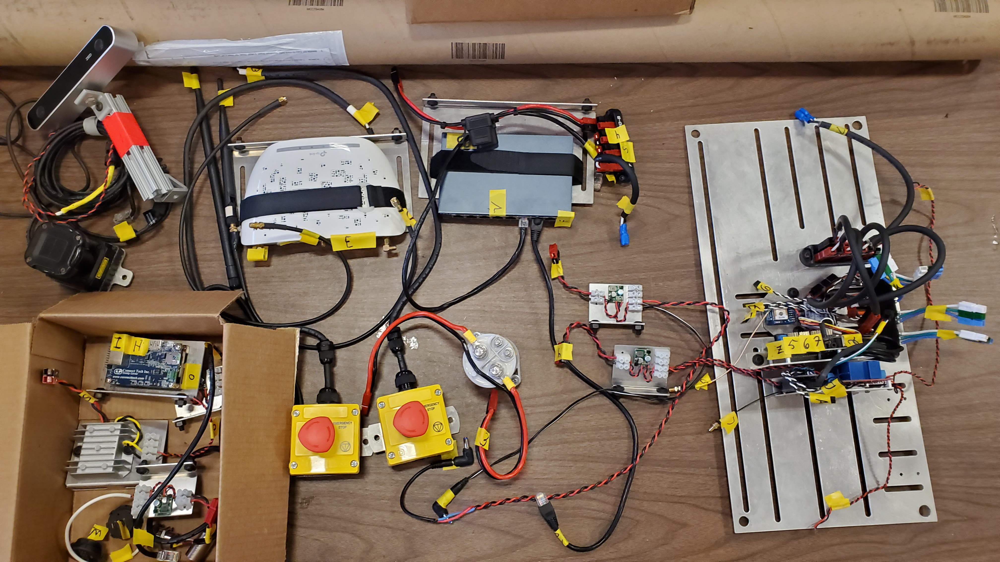
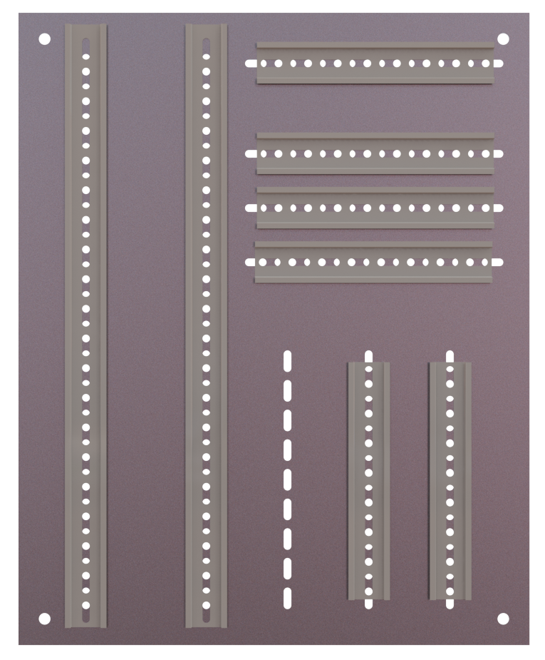

Team Lead:

 Joseph Stevens - joseph.stevens1@louisiana.edu

Members:

* Nathan Madsen   - nathan.madsen1@louisiana.edu
* Brennan Moeller - Brennan.moeller1@louisiana.edu
* Benjamin Willis - benjamin.willis1@louisiana.edu

# Integration of a UAV to the RoboBoat to aid in task completion and navigation

## Long-term Project Goal

Integrate a rotary UAV to the RoboBoat to increase the points gained while completing certain tasks and aid in navigating the courses more efficiently.

## Short-term Goal

To complete a working final draft of design tools, continuously update Gantt chart, and to finish the final presentation by November 6^th's team meeting.

## Recent Results Overview

1. As a team, we went back through the [Specification Sheet, House of Quality, and Function tree](http://crawlab.org/owncloud/index.php/apps/files/?dir=%2Fshared%2FRoboBoat%2FRoboBoat2021%2FSeniorProjects_Design_Tools) and have updated the comments that were given to us. For the Function Tree we have went back through it a little bit, but are waiting to discuss this in our weekly meeting on Thursdays. **Team**

 * The robotic sensing accuracy requirements of the UAV have been expanded and broken into sub-categories. **Team**

 * When expanding the accuracy requirements of the UAV's, it was determined that precision is equally ,if not more, important. One of the main reasons we found precision to be important is repeatability. Considering the fact that these sensors will be reading and transmitting new data within fractions of a second, getting a repeatable reading while in the same location will be imperative. If our sensors are decently accurate but not precise, it will be very difficult for us to zero in on a specific location or object. Accuracy is important but for the accuracy of that sensor to be useful, precision is imperative. Although precision is an important variable, we do not believe it will be determinable factor on the specification sheet. We believe the precision of our sensors will be governed by our end budget and the availability of quality sensors. **Team**

2. As a team, we have created a [Morphological Chart](http://crawlab.org/owncloud/index.php/apps/files/?dir=%2Fshared%2FRoboBoat%2FRoboBoat2021%2FSeniorProjects_Design_Tools). It is a working document because we have had to go back through our design tools to make sure we are understanding the requirements needed by a final design. **Team**

3. Discussed procedure for aiding the RoboBoat in navigating the course: Plan to aid the ASV by capturing a data set of each task and communicating the information to the ASV as opposed to capturing the entire course. We are planning to be a task ahead of the ASV. We plan to use the GPS coordinates provided by RoboBoat to deploy the UAV in the general direction of the next "Task". Following deployment, two ideas were discussed; recognizing the color of the buoys, or detecting geometry of the tasks layout(convex hull/cluster analysis). Afterwards, the UAV could work as a "pin" for the boat to find; given that the ASV will know its approximate relative position to the UAV and its approximate global position. The development of these ideas continue to advance while working through the design tools, but are not final. ***(I don't know if this is the way we want to put it.???)***     **Team**

4. We are close to being finished breaking down the old enclosure. The old enclosure was taken off of the boat, and the CAD model for a new mounting plate was started. The lay out of the electronics needs to be discussed and finalized. **Team**
   
    

     
    <strong>Figure 1: Breakdown of electronics</strong>

 
  
    

     
    <strong>Figure 2: Electronics Mount</strong>

 
  

## Questions/Comments

1. I feel like we are thinking about precision correctly, but would like to know your thoughts on what was mentioned above. **JS**

2. 

## Plan for the next two weeks

1. Revise working final drafts of design tools
3. Continue compiling a Morphological chart
4. Figure out how to ssh into the Stingray over Wifi
5. Begin compiling Final Presentation charts and graphs and start outlining the final paper
6. Get presentation completed for November 6^th's lab meeting.
7. We are still waiting to register with RoboNation

### What are your next steps?

#### As a team

1. Finish revisions of current design tools
2. Complete the presentation for the November 6(th) lab meeting.
3. Work on final report
4. Finish the morphological chart and submit for review
5. Finish the evaluation matrix and submit for review
6. Use the design tools to come to a conclusion for the final UAV design.
7. Write and submit proposal for UAV

#### Individually

1. I (Brennan) plan to continue diving into ROS. I have some Udemy courses that I can leverage to learn ROS basics. Work with the robot that Dr. Vaughan left with the team. Work on finalizing the electronics mount.

2. I (Nathan) plan to work on an online course which will include learning the basic control of a drone, drone exploration, and drone navigation. Work with the robot that Dr. Vaughan left with the team and Kyle.

3. I (Ben) plan to get into understanding the basics of ROS and I will be helping out wherever I am needed. I (as well as the rest of the team) will also be working on adding more to the Specification Sheet, morphological chart, and the Evaluation Matrix. Work with the robot that Dr. Vaughan left with the team and Kyle.

4. I (Joseph) will be working mainly focusing on getting the design tools to a point that enables us to come to a conclusion on our final UAV design. Also, my attention will be on our final report and presentation.

### What work do you expect to have done by next report? What results to you expect?

By next report, we expect to have all design tools completed and a final UAV design determined.

### Are we on schedule with respect to the GitHub Project and/or Gantt Chart?

No we are not on schedule for this semester, but we are working diligently to catch up and get back on pace.

# Long-term planning

We want to have the final design concept decided by last week of October. We would like to have the UAV flying autonomously with a camera attached to the bottom of it within a pre-defined area by the begging of next semester. We want to fully test this design by late February, early March to have time to correct the flaws in the coding and design. We are looking to have the UAV fly autonomously with a camera attached to it, collect data that represents objects, raise/deliver an object, and have the UAV integrated with ASV by the end of next semester.

## Up coming Paper Deadlines

1. We need to have a final presentation prepared by Friday November, 6th to present to the Lab in our weekly meeting
2. Final Team Presentations: due dates range from November 9th - November 16th
3. Final Report is due Friday November 20th by 12:00PM

## Administrative Deadlines

None yet. Waiting on rules form RoboNation to be released.
