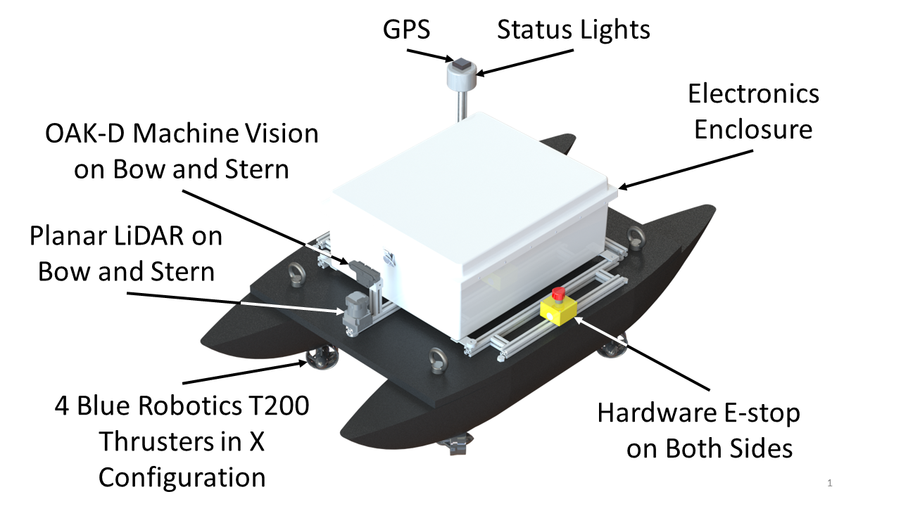
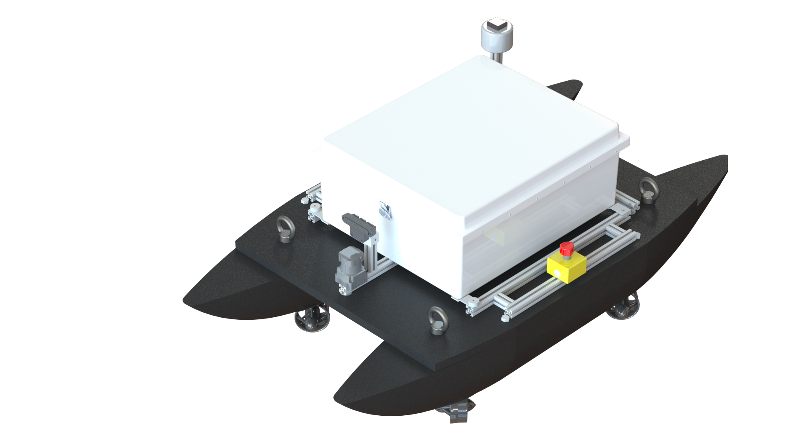
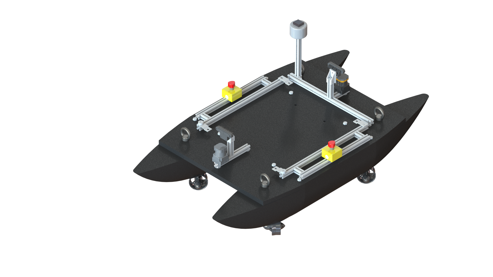
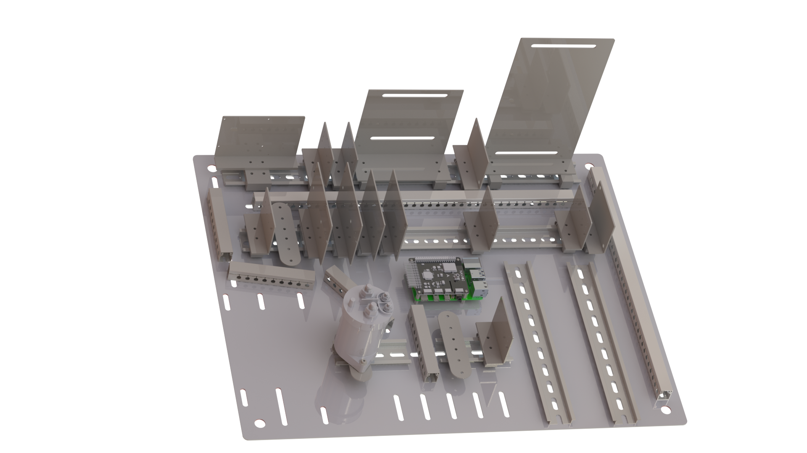
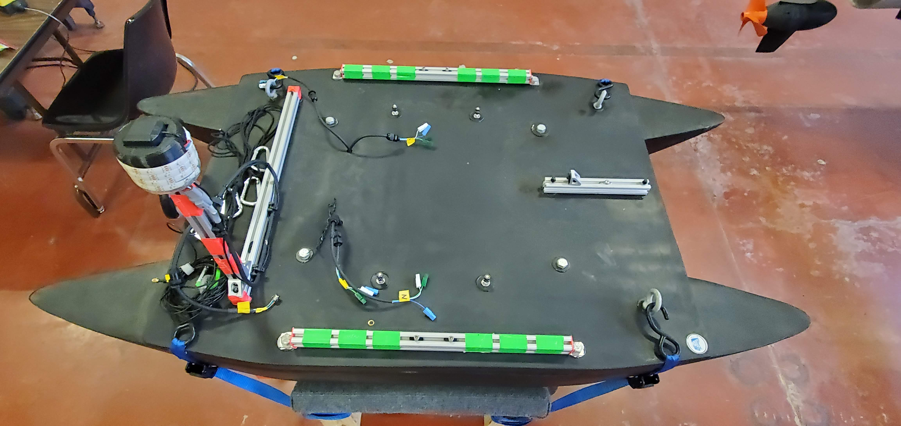
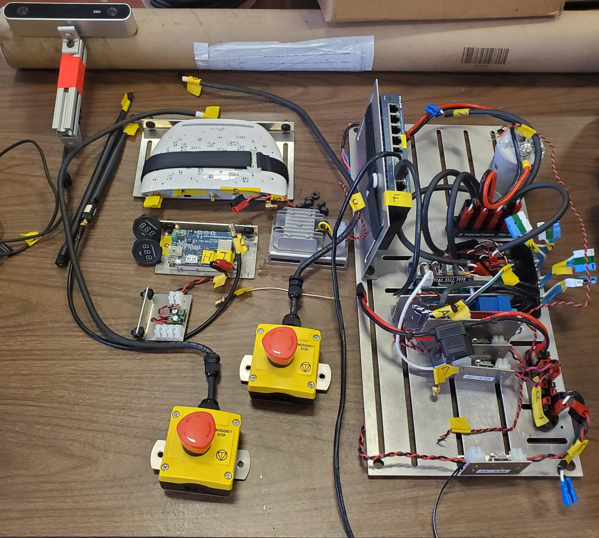
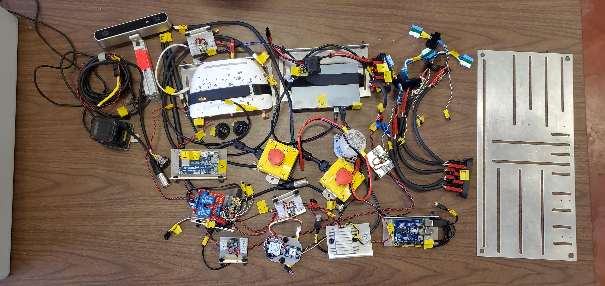

  
  
  
  
  

  
  

## 2021 UL Lafayette Ragin' Cajuns ASV
  
  - The ASV for the 2021 competition is an improved version of the previous system. The computer aided design can be seen below following the cad is the current state of the ASV. 

     
    <strong>2021 ASV System(Need to update with just ASV Picture)</strong>

     
    <strong>2021 ASV CAD</strong>

   - This ASV was custom fabricated at UL Lafayette in 2019. It uses four Blue Robotics T-200 thrusters in an unique X configuration to allow holonomic motion. For perception, it has an Oak-D machine vision sensor and a Hokuyo LiDAR on both the bow and stern. This system has two NVIDIA Jetson TX2s for the heavy computation and a Raspberry Pi 4 with an EMLID NAVIO2 control HAT to aid in motor control and various sensing capabilities.

## The New Enclosure
* The cad files for the new enclosure was used to create new mounting brackets for this enclosure. 8020 T-Slotted frame was used because of its adaptability and ease of assembly. 

     
    <strong>Complete ASV System</strong>

     
    <strong>Electronics Enclosure Brackets</strong>

## The New Electronics 

- The new electronics enclosure utilizes DIN-Rail to create easy mounting and arranging of the internal computers, sensors, and other electronics used in operation of the multi-agent system. 

     
    <strong>2021 New Electronics Mount</strong>

- This years team was tasked with upgrading the system's electronics enclosure and electronics. The teardown of the old enclosure took place in late 2020.. 

     
    <strong>2020 ASV System Teardown</strong>

     
    <strong>2020 ASV System's Electronics Teardown</strong>

     
    <strong>2020 ASV System's Electronics Teardown</strong>

*More Coming soon...*