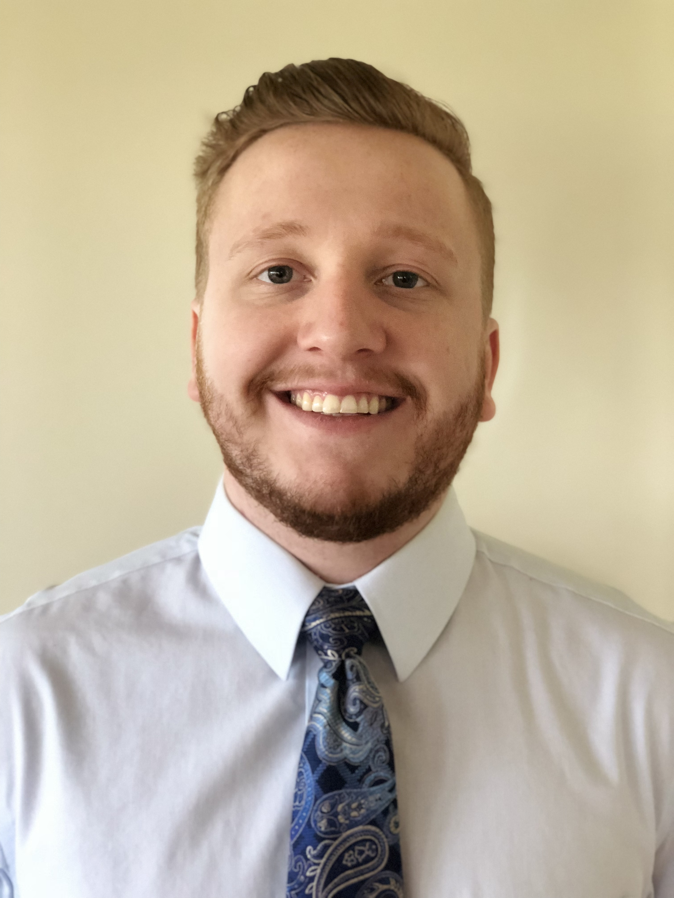

  
  
  
  
  

  
  

## 2021 UL Lafayette Ragin' Cajuns RoboBoat

Welcome to the [University of Louisiana at Lafayette's](https://louisiana.edu) entry into the [2021 RoboBoat Competition](https://roboboat.org/programs/2021/). This is the Ragin' Cajuns' third design submission to RoboBoat. We are very excited to show off our progress through the past nine months, so please take a look and enjoy! 

<!-- Meet the 2021 RoboBoat Team -->

<h2 style="text-align:center;">Meet the 2021 RoboBoat Team </h2>
  <h3 style="text-align:center;"> Coaches </h3>

  - Add Dr. Joshua Vaughan
      - Write about how he has guided this team to the success it is at and he has always been there for us!
      - Are these appropriate to use?
        - [C.R.A.W. LAB](https://userweb.ucs.louisiana.edu/~jev9637/)
        - [Dr. Vaughan - Louisiana Introduction Page](https://mechanical.louisiana.edu/node/155)
        - [Github Page](https://github.com/DocVaughan)
        - Any other links to add?
      - Email: *joshua.vaughan@louisiana.edu*

  - Add Ms. Yasmeen Qudsi
      - Write about how Yasmeen has repeatedly gone out of her way to make sure this team is taken care of to make sure this team becomes a success!
          - This includes how she helped teach us to solder, helped water-jet four parts for us, given us some tricks and trades for making sure we are doing the correct "things" with electronics.
      - Is this appropriate to use?
        - [Ms. Qudsi - Louisiana Introduction Page](https://mechanical.louisiana.edu/node/163)
      - Any other links to add?
      - Email: *yasmeen.qudsi@louisiana.edu*

 

  <h3 style="text-align:center;"> Team Members (Joseph Stevens (Captain), Brennan Moeller, Benjamin Willis, Nathan Madsen, Adam Smith, etc.) </h3>

  - Write about what each team member has done for this project and what they have to show for it.
        - Should we have this as a standard picture or a flowing picture (where the people would be in frame for x seconds and then the next person goes into the frame?)
    - Joe: Team Captain
        - Any links to add?

    - Brennan Moeller: Communications Director
      - Brennan was responsible for implementing the Docker containers on all computers and creating an upgraded network system for the addition of the UAV to the previous system among other various tasks
      - [Brennan's LinkedIn](https://www.linkedin.com/in/brennan-moeller-b31ba7163/)
     

      
     (This can be changed as needed)
     

    - Ben: Manufacturing Director (Is this the correct role for Ben?)
        - Any links to add?
    - Nathan: Navigation Director (Is this the correct role for Nathan?)
        - Any links to add?
    - Adam Smith: Grad Student (He should have some sort of role since he has helped us put together the ASV)
        - Any links to add?
    - Anyone else?

  <h3 style="text-align:center;"> Design Documents? </h3>

  - [TDR]()
  - [Skills Video: Sensor Optimization]()
  - [Skills Video: Power Management]()
  - [Demonstration Video]()

*More coming soon...*