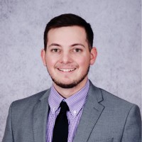

  
  
  
  
  

  
  

## 2021 UL Lafayette Ragin' Cajuns RoboBoat

Welcome to the [University of Louisiana at Lafayette's](https://louisiana.edu) entry into the [2021 RoboBoat Competition](https://roboboat.org/programs/2021/). This is the Ragin' Cajuns' third design submission to RoboBoat. We are very excited to show off our progress throughout the past nine months, so please take a look and enjoy! 

<!-- Meet the 2021 RoboBoat Team -->

<h2 style="text-align:center;">Meet the 2021 RoboBoat Team </h2>
  <h3 style="text-align:center;"> Coaches </h3>

	<strong style="text-align:center;"></strong> 
	 
	<b style="text-align:center;">Dr. Joshua Vaughan</b>

	<strong style="text-align:center;"></strong> 
	 
	<b style="text-align:center;">Ms. Yasmeen Qudsi</b>

<!--
  ### **Dr. Joshua Vaughan**
      - Write about how he has guided this team to the success it is at and he has always been there for us!
      - Are these appropriate to use?
        - [C.R.A.W. LAB](https://userweb.ucs.louisiana.edu/~jev9637/)
        - [Dr. Vaughan - Louisiana Introduction Page](https://mechanical.louisiana.edu/node/155)
        - [Github Page](https://github.com/DocVaughan)
        - Any other links to add?
      - Email: *joshua.vaughan@louisiana.edu*
-->

<!--
  ### *Ms. Yasmeen Qudsi*
      - Write about how Yasmeen has repeatedly gone out of her way to make sure this team is taken care of to make sure this team becomes a success!
          - This includes how she helped teach us to solder, helped water-jet four parts for us, given us some tricks and trades for making sure we are doing the correct "things" with electronics.
      - Is this appropriate to use?
        - [Ms. Qudsi - Louisiana Introduction Page](https://mechanical.louisiana.edu/node/163)
      - Any other links to add?
      - Email: *yasmeen.qudsi@louisiana.edu*
-->
 
 
 
 
 
 
 
 
 
 

  <h3 style="text-align:center;"> Team Members </h3>

  <h4 style="text-align:left;"><b>Joe: Team Captain</b></h4>

  

 
 
  - Joe was responsible for leading this team. <!-- Please update for us -->
  - Any links to add?
 
 
 
 
 

  <h4 style="text-align:left;"> <b> Brennan Moeller: Communications Director</b></h4>

  

 
 
  - <!-- Should we add this?: Brennan was responsible for managing this teams comminications with our clients and advisors.--> Brennan was responsible for implementing the Docker containers on all computers and creating an upgraded network system for the addition of the UAV to the previous system among other various tasks 

  - [Brennan's LinkedIn](https://www.linkedin.com/in/brennan-moeller-b31ba7163/)
  
 
 
 

  <h4 style="text-align:left;"> <b> Ben: Manufacturing Director</b></h4>

  

 
 
  - Ben was responsible for creating part files for the UAV. He was also resposible for inputting the UAV into simulation as well as testing the drone to make sure it works in both simulation and in real life. <!-- Please update for us -->

  - [Ben's LinkedIn](www.linkedin.com/in/BenjaminRWillis)

 
 
 

  <h4 style="text-align:left;"> <b> Nathan: Navigation Director</b></h4>

  

 
 
  - Nathan was responsible for creating custom mounts for the LiDAR Lite and Raspberry Pi Camera. He also was responsible for collecting image data from the OAK-D Stereo camera.

 <!-- Please update for us -->

  - [Nathan's LinkedIn](www.linkedin.com/in/nathan-madsen-ab9aa01a9)

 <!-- Please update for us -->
  - Any links to add?

 
 
 
 
 
 

  <h4 style="text-align:left;"> <b> Adam Smith: Grad Student</b></h4>

  

 
 
 <!-- Please update for us -->
  - Any links to add?

 
 
 
 
 

<!-- Please add if there are other people involved in this years comp.   ### **Anyone else?** -->

  <h3 style="text-align:center;"> Design Documents </h3>

  - [TDR]()
  - [Skills Video: Sensor Optimization]()
  - [Skills Video: Power Management]()
  - [Demonstration Video]()
  - [Gantt Chart](https://github.com/CRAWlab/RoboBoat-2021/tree/master/docs/files/Senior%20Project%20Gantt_2021_04_19.xlsx)

*More coming soon...*